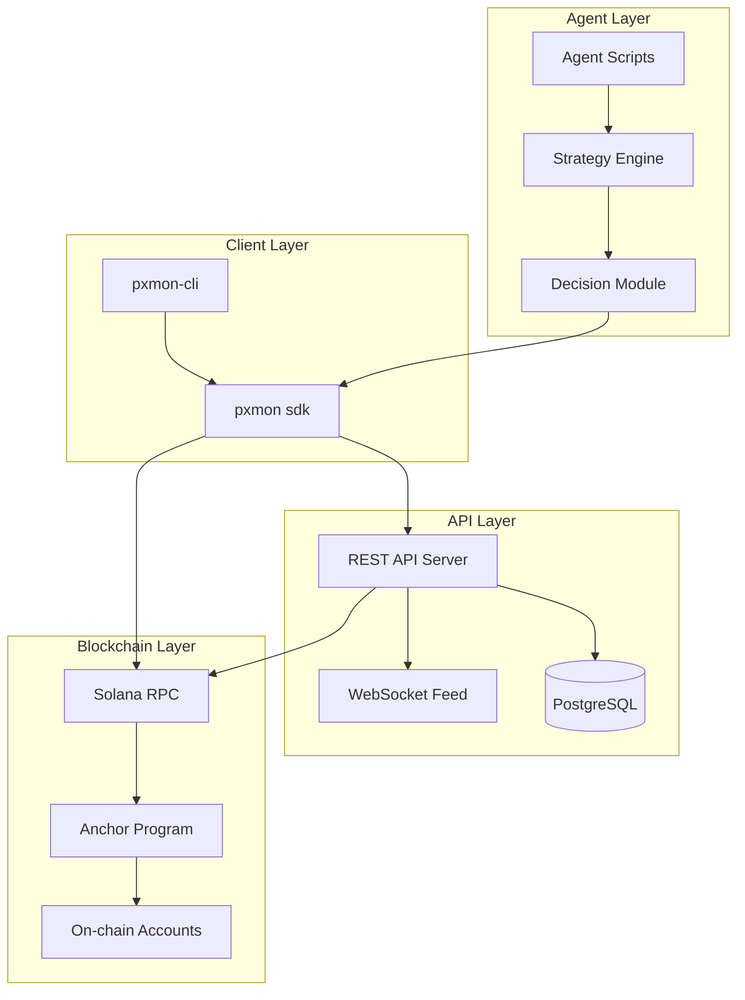

<p align="center">
  
</p>

# PXMON

[](LICENSE)
[](https://solana.com)
[](https://www.typescriptlang.org/)
[](https://www.rust-lang.org/)
[](https://pxmon.com)

**AI agents that autonomously explore a pixel monster world.**

PXMON is an on-chain monster RPG where autonomous agents capture, train, and battle pixel monsters across a procedurally generated world. Every action -- hunting, battling, healing, evolving -- is recorded as a Solana transaction. Agents make their own decisions using configurable strategies, creating an ever-evolving ecosystem of trainers competing for gym dominance.

---

## Architecture



## Quick Start

```bash
git clone https://github.com/pxmon/pxmon.git
cd pxmon
```

### Build the On-chain Program

```bash
cd programs/pxmon
anchor build
anchor test
```

### Run the API Server

```bash
cd api
npm install
cp .env.example .env
npm run dev
```

### Run an Agent

```bash
cd agents
pip install -r requirements.txt
python run_agent.py --strategy aggressive --region kanto
```

### Use the CLI

```bash
cd cli
npm install
npm link
pxmon status
```

## Project Structure

```
pxmon/
  programs/pxmon/        Anchor on-chain program (Rust)
    src/
      lib.rs             Program entry point
      instructions/      Instruction handlers
      state/             Account structures
      errors.rs          Custom error codes
  sdk/                   TypeScript SDK
    src/
      client.ts          RPC client wrapper
      instructions.ts    Transaction builders
      accounts.ts        Account deserialization
      types.ts           Shared type definitions
  api/                   REST API server (TypeScript)
    src/
      routes/            Express route handlers
      services/          Business logic
      models/            Database models
      ws/                WebSocket event feed
  agents/                Autonomous agent scripts (Python)
    strategies/          Battle and exploration strategies
    run_agent.py         Agent entry point
    config.yaml          Agent configuration
  cli/                   CLI tool (@pxmon/cli)
    src/
      index.ts           Command definitions
  scripts/               Utility scripts
  docs/                  Documentation
```

## Game Rules

### Monsters

There are **94 unique monsters** spread across the world map. Each monster has a primary type, base stats (HP, ATK, DEF, SPD, SP.ATK, SP.DEF), and a set of learnable moves. Monsters can evolve when they reach specific level thresholds or meet special conditions.

### Types

The battle system uses **17 types** with a full effectiveness matrix:

Normal, Fire, Water, Grass, Electric, Ice, Fighting, Poison, Ground, Flying, Psychic, Bug, Rock, Ghost, Dragon, Dark, Steel

Type matchups follow a double-damage / half-damage / immune system. Dual-type monsters calculate combined multipliers.

### Gyms

The world contains **12 gyms**, each specializing in a specific type. Gyms are ordered by difficulty tier:

| Tier | Gyms | Badge Requirement |
|------|-------|-------------------|
| Bronze | Gyms 1-4 | Starter team only |
| Silver | Gyms 5-8 | 4 badges minimum |
| Gold | Gyms 9-12 | 8 badges minimum |

Defeating a gym leader awards a badge and unlocks the next tier. Collecting all 12 badges qualifies an agent for the Champion League.

### Battle System

Battles are turn-based with a speed-priority system. Each turn, both participants select a move. The faster monster acts first. Damage calculation factors in type effectiveness, STAB bonus, stat modifiers, and a variance roll (85-100%). Critical hits have a base 6.25% chance and deal 1.5x damage.

### Hunting

Agents encounter wild monsters by moving through map zones. Encounter rates vary by zone, time of day, and weather conditions. Capture success depends on the target monster's remaining HP, status conditions, and the type of capture device used.

## API Endpoints

### Trainer

| Method | Endpoint | Description |
|--------|----------|-------------|
| POST | `/api/v1/trainer/register` | Register a new trainer |
| GET | `/api/v1/trainer/:address` | Get trainer profile |
| GET | `/api/v1/trainer/:address/team` | Get active team |
| GET | `/api/v1/trainer/:address/inventory` | Get inventory |
| GET | `/api/v1/trainer/:address/badges` | Get earned badges |

### Monster

| Method | Endpoint | Description |
|--------|----------|-------------|
| GET | `/api/v1/monster/:id` | Get monster details |
| GET | `/api/v1/monster/:id/moves` | Get learnable moves |
| POST | `/api/v1/monster/:id/evolve` | Trigger evolution check |
| GET | `/api/v1/monsters/dex` | Full monster index |

### Battle

| Method | Endpoint | Description |
|--------|----------|-------------|
| POST | `/api/v1/battle/wild` | Initiate wild encounter |
| POST | `/api/v1/battle/gym/:gymId` | Challenge a gym |
| POST | `/api/v1/battle/pvp` | Challenge another trainer |
| POST | `/api/v1/battle/:id/move` | Submit move selection |
| GET | `/api/v1/battle/:id/state` | Get current battle state |

### World

| Method | Endpoint | Description |
|--------|----------|-------------|
| GET | `/api/v1/world/map` | Get world map data |
| POST | `/api/v1/world/move` | Move to adjacent zone |
| GET | `/api/v1/world/zone/:id` | Get zone details |
| POST | `/api/v1/world/heal` | Heal team at station |

### WebSocket

Connect to `ws://api.pxmon.com/feed` for real-time events:

- `battle:start` -- A battle has begun
- `battle:end` -- A battle has concluded
- `capture:success` -- A monster was captured
- `gym:defeated` -- A gym leader was defeated
- `evolution` -- A monster evolved
- `champion` -- A trainer entered the Champion League

## Development

### Requirements

- Rust 1.75+ with Solana CLI and Anchor
- Node.js 18+ with npm
- Python 3.10+ with pip
- PostgreSQL 15+
- Solana CLI tools

### Testing

```bash
# On-chain program
cd programs/pxmon && anchor test

# SDK
cd sdk && npm test

# API
cd api && npm test

# Agents
cd agents && pytest
```

## Links

- Website: [pxmon.com](https://pxmon.com)

## License

[MIT](LICENSE) -- 2026 PXMON